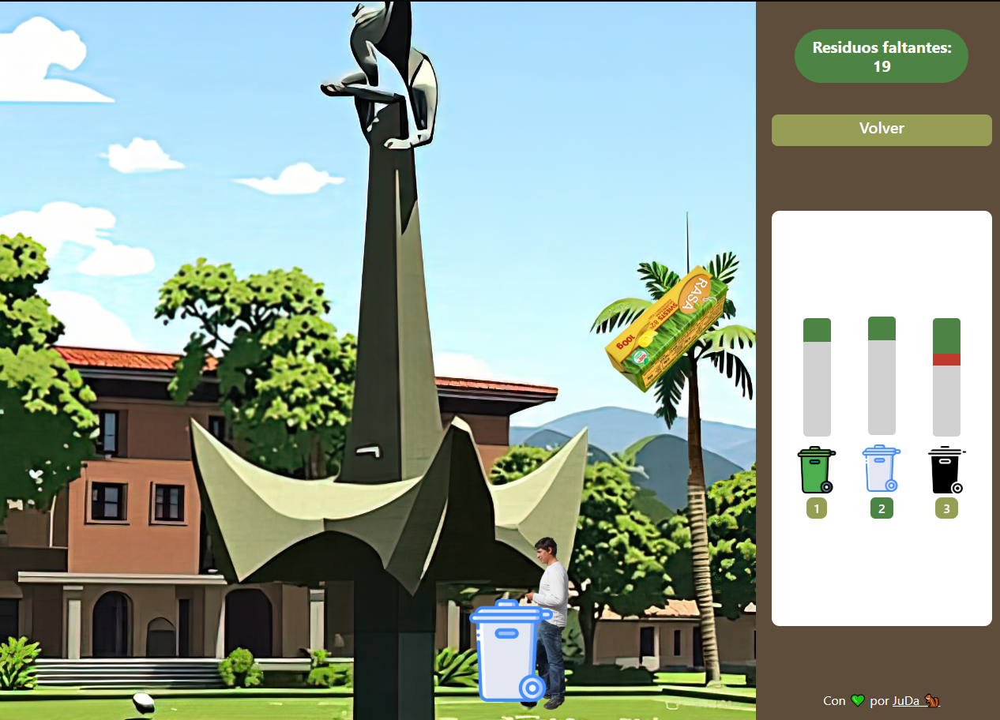

# Ecoclasifica UdeA - Juego

Bienvenido al juego Ecoclasifica UdeA, una aplicación interactiva diseñada para practicar la clasificación de residuos de forma educativa y divertida. Este proyecto está desarrollado como un juego en HTML, CSS y JavaScript, utilizando Bootstrap para el diseño responsive y animaciones personalizadas.

## Descripción
El juego simula un entorno donde el jugador debe clasificar residuos (orgánicos, reciclables y no reciclables) usando canecas específicas. El objetivo es llenar correctamente las canecas mientras se evitan errores, con retroalimentación visual y sonora.

## Características
- **Clasificación de residuos**: Usa las teclas 1, 2 y 3 para seleccionar las canecas verde (orgánicos), blanca (reciclables) y negra (no reciclables).
- **Movimiento del jugador**: Controla al personaje con las flechas izquierda y derecha.
- **Cambio de personaje**: Presiona la tecla G en cualquier momento para alternar entre dos personajes.
- **Retroalimentación**: Emojis y sonidos indican aciertos (✅), errores (❌) y canecas llenas (➖).
- **Progreso**: Se muestra el porcentaje de clasificación correcta al finalizar el nivel.

## Vista Previa


## Instalación
1. Clona el repositorio:
   ```bash
    git clone https://github.com/Juda-Tech-Green/ecoclasficia_udea
   ```

2. Navega al directorio:
    ```bash
    cd ecoclasifica_udea
    ```

3. Inicia el servidor:
    ```bash
    node server.js
    ```

4. Ve a http://localhost:3000/

## Uso

- **Usa las teclas ArrowLeft y ArrowRight para mover al jugador.**
- **Presiona 1, 2 o 3 para seleccionar la caneca activa.**
- **Presiona G para cambiar de personaje en cualquier momento.**
- **Clasifica los 30 residuos que caen para completar el nivel.**

## Licencia 

MIT License - Libre para usar y modificar.